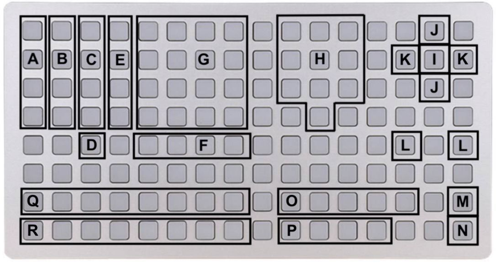

Dizzy

a binary rhythmbox

each track features 4 slots containing decimal values between 0 and 255. a decimal is converted to its binary representation and played in a sequence of binary where 1 sends a trigger and 0 denotes a break. a track can be muted, has its own probability and divisions, each sequence can be rotated along its binary string. the sequencer is enhanced for performance using a grid, can be externally clocked and sends midi notes.

##home

the first view is the main interface
on this page

- ENC 1 changes BPM 
- ENC 2 changes track
- ENC 3 changes value

- KEY 1 takes you to PARAMS
- Hold KEY 1 to start the sequencer
- While playing, hold KEY 1 for SEQ ALT
- SEQ ALT + KEY 2 stops the sequence
- SEQ ALT + KEY 3 resets the sequence

- KEY 2 changes slot on selected track
- KEY 2 + KEY 3 mutes the track

- Hold KEY 3 for TRACK ALT
- TRACK ALT + KEY 2 rotates track sequence
- TRACK ALT + ENC 2 changes track division
- TRACK ALT + ENC 3 changes track probability

each track is configured to send midi and trigger a sample. please see the PARAMETERS menu for configuration.

##grid

using grid greatly expands the performability of dizzy. it allows for looping, changing sequence values in both binary and decimals, alongside some performance controls such as sample triggers, mutes, reverb and delay controls and randomisation. reverb and delay effects have their own view, found by holding the reverb and delay view keys which then allow for fx control with the norns encoders.

A - trigger samples
B - mute track
C - track reverb send switch (-60.0db : 0db)
D - kill all reverb sends
E - change track
F - change selected slot
G - loop slot
H - decimal number pad to input decimals
I - hold to add more decimals to same slot (ie, 2 to 1 = 12)
J - change tracks
K - change selected slot
L - rotate forward or backwards track sequence
M - reset all sequences to start
N - start / stop
O - reverb
    - reverb level switch (-60.0db : 0db)
    - random short reverb
    - random mid reverb
    - random long reverb
    - reverb view 
      - enc 1 - reverb level
      - enc 2 - reverb room size
      - enc 3 - reverb damp
P - echo (halfsecond)
    - echo send mute
    - echo edit view
      - enc 1 - echo level
      - enc 2 - rate
      - enc 3 - feedback
    - randomise echo
    - kill echo
Q - binary input, tap for 1, tap twice for 0
R - trim binary sequence at index

##saving/ loading your work
to save your loaded samples and their settings, navigate to the PARAMETERS page and hold Norns Key1. turn Enc2 to select save, and Enc3 to scroll through available save slots. use Key3 to save your data to the slot.
